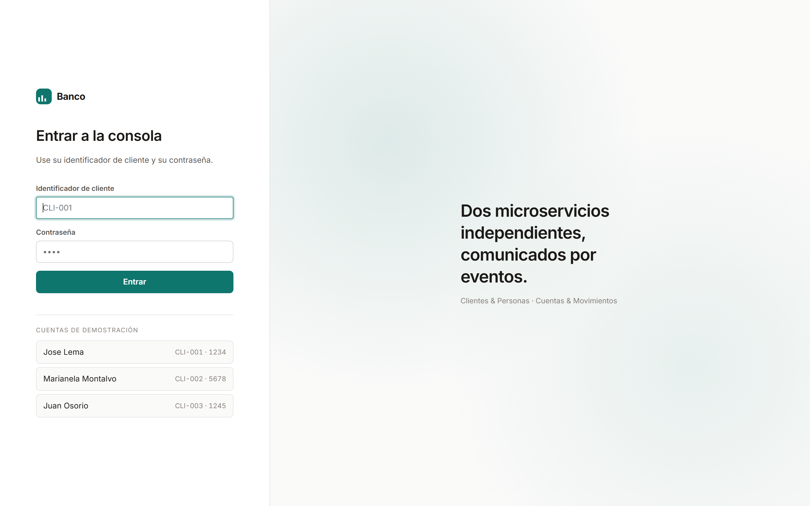
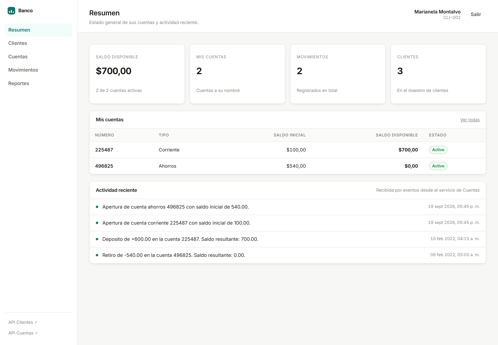
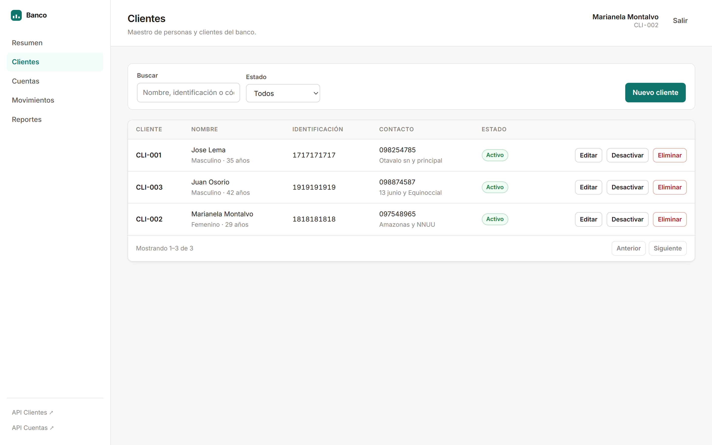
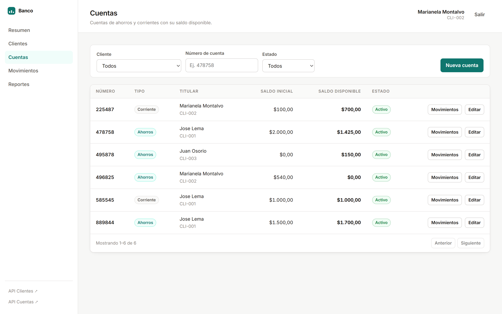
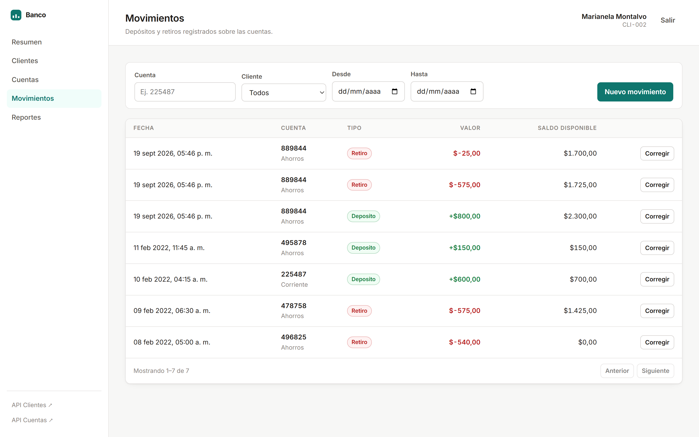
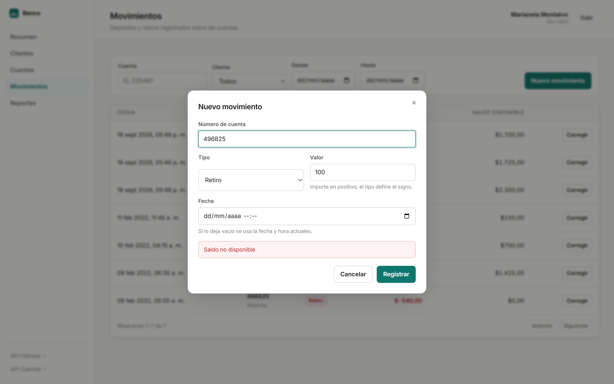
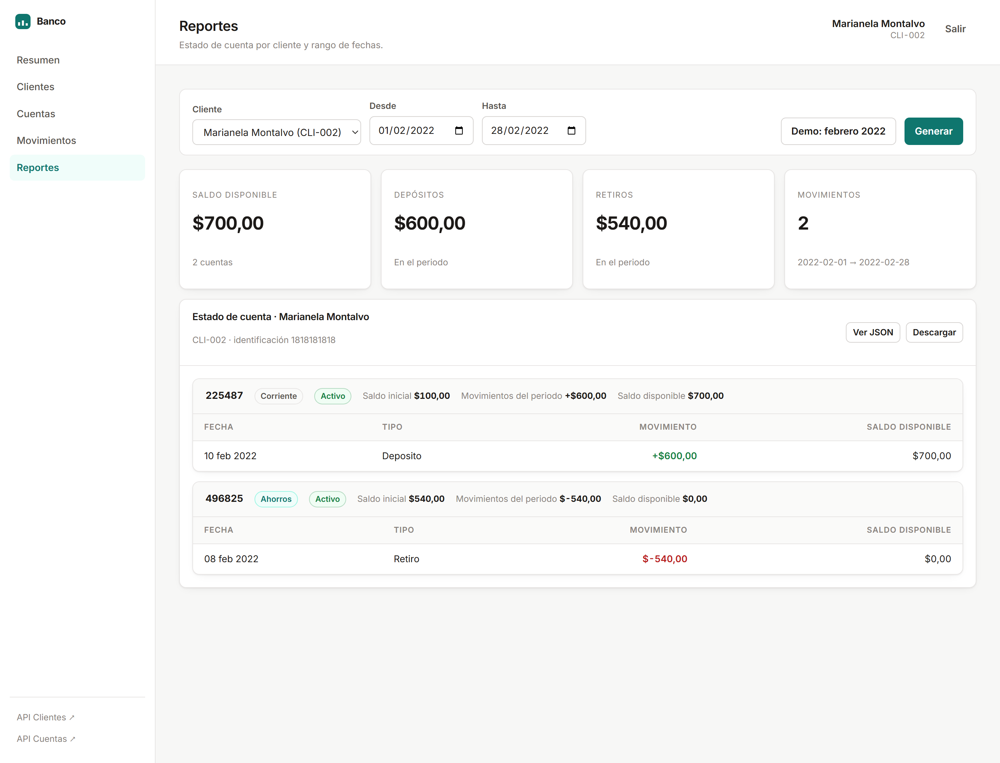
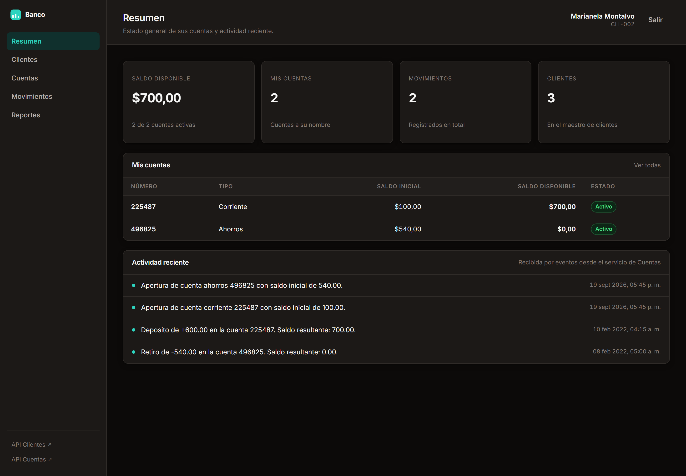

# Banco · Arquitectura de microservicios

Solución al ejercicio técnico: dos microservicios independientes —**Clientes/Personas** y
**Cuentas/Movimientos**— comunicados de forma **asíncrona** por eventos, con base de datos
relacional propia para cada uno, API REST documentada, pruebas automatizadas, consola web y
despliegue completo en Docker.

```bash
docker compose up --build
```

Al terminar, abra **<http://localhost:5080>** y entre como `CLI-002` / `5678`.

---

## Contenido

- [Qué se entrega](#qué-se-entrega)
- [Arranque](#arranque)
- [Arquitectura](#arquitectura)
- [La comunicación asíncrona](#la-comunicación-asíncrona)
- [Estructura del repositorio](#estructura-del-repositorio)
- [Modelo de datos](#modelo-de-datos)
- [API](#api)
- [Manejo de errores](#manejo-de-errores)
- [Consola web](#consola-web)
- [Capturas](#capturas)
- [Pruebas](#pruebas)
- [Base de datos](#base-de-datos)
- [Rendimiento, escalabilidad y resiliencia](#rendimiento-escalabilidad-y-resiliencia)
- [Decisiones y compromisos](#decisiones-y-compromisos)
- [Desarrollo sin Docker](#desarrollo-sin-docker)
- [Si algo no arranca](#si-algo-no-arranca)

---

## Qué se entrega

| Requisito | Estado | Dónde verlo |
|---|---|---|
| **F1** CRUD de Cliente, CRU de Cuenta y Movimiento | ✅ | `/api/clientes`, `/api/cuentas`, `/api/movimientos` |
| **F2** Registro de movimientos y actualización del saldo | ✅ | [`Cuenta.RegistrarMovimiento`](src/Cuentas/Cuentas.Domain/Cuentas/Cuenta.cs) |
| **F3** «Saldo no disponible» ante fondos insuficientes | ✅ | [`ExcepcionSaldoNoDisponible`](src/BuildingBlocks/Shared.Kernel/Excepciones/ExcepcionSaldoNoDisponible.cs) |
| **F4** Reporte «Estado de cuenta» por rango y cliente | ✅ | `GET /api/reportes?fecha={rango}&cliente={id}` |
| **F5** Prueba unitaria de la entidad de dominio Cliente | ✅ | [`PruebasEntidadCliente`](tests/Clientes.UnitTests/Dominio/PruebasEntidadCliente.cs) — 16 casos (23 con los `[Theory]`) |
| **F6** Prueba de integración | ✅ | [`PruebasApiMovimientos`](tests/Cuentas.IntegrationTests/PruebasApiMovimientos.cs) — 18 pruebas de extremo a extremo |
| **F7** Despliegue en contenedores | ✅ | [`docker-compose.yml`](docker-compose.yml) — 5 servicios |
| Separación en 2 microservicios | ✅ | `src/Clientes/` y `src/Cuentas/`, bases y despliegues separados |
| Comunicación asíncrona entre ambos | ✅ | RabbitMQ + patrón Outbox, **en los dos sentidos** |
| Entity Framework Core | ✅ | Migraciones, configuraciones explícitas, herencia TPT |
| Manejo de excepciones | ✅ | [`MiddlewareManejoExcepciones`](src/BuildingBlocks/Shared.Api/Errores/MiddlewareManejoExcepciones.cs) |
| Script `BaseDatos.sql` | ✅ | [`db/BaseDatos.sql`](db/BaseDatos.sql) |
| Colección de Postman | ✅ | [`postman/`](postman/) — 39 peticiones, 148 asserts |

**Extras incluidos:** autenticación JWT compartida por los dos servicios, consola web para operar
el sistema como usuario, paginación y filtros en todos los listados, sondas de salud, registro
estructurado, bandeja de salida transaccional y contraseñas derivadas con PBKDF2.

---

## Arranque

**Requisitos:** Docker Desktop (o Docker Engine + Compose v2). Nada más: el SDK de .NET solo hace
falta para ejecutar las pruebas fuera de los contenedores.

```bash
git clone <url-del-repositorio>
cd sistema-basico-test
docker compose up --build
```

La primera construcción descarga las imágenes base y compila ambos servicios (unos 2-3 minutos).
El stack está listo cuando los cinco contenedores aparecen `healthy`:

```bash
docker compose ps
```

### Puertos y accesos

| Servicio | URL | Credenciales |
|---|---|---|
| **Consola web** | <http://localhost:5080> | ver más abajo |
| API Clientes (Swagger) | <http://localhost:5081/swagger> | token JWT |
| API Cuentas (Swagger) | <http://localhost:5082/swagger> | token JWT |
| RabbitMQ (administración) | <http://localhost:15673> | `banco` / `banco` |
| PostgreSQL | `localhost:5442` | `banco` / `banco` |

> Los puertos están desplazados a propósito (5080+, 5442, 5673) para no chocar con lo que ya
> suela estar corriendo en la máquina.

### Usuarios de prueba

Son los del caso 1 del enunciado, con sus contraseñas. La pantalla de acceso los ofrece en un clic.

| Cliente | Nombre | Contraseña |
|---|---|---|
| `CLI-001` | Jose Lema | `1234` |
| `CLI-002` | Marianela Montalvo | `5678` |
| `CLI-003` | Juan Osorio | `1245` |

Al arrancar, el sistema carga también las cuentas y movimientos de los casos 2 a 5, **fechados en
febrero de 2022**, de modo que el reporte F4 sobre ese mes reproduce exactamente el listado
publicado en el enunciado.

### Detener

```bash
docker compose down          # conserva los datos
docker compose down -v       # borra también los volúmenes y vuelve al estado inicial
```

---

## Arquitectura

```
                            ┌──────────────────────────────┐
                            │   Consola web  ·  :5080      │
                            │   HTML + CSS + módulos ES    │
                            └──────────────┬───────────────┘
                                           │  un solo origen
                            ┌──────────────▼───────────────┐
                            │   nginx  (proxy inverso)     │
                            └───────┬──────────────┬───────┘
                 /api/clientes      │              │   /api/cuentas
                                    │              │   /api/movimientos
                                    │              │   /api/reportes
                  ┌─────────────────▼───┐      ┌───▼─────────────────┐
                  │   CLIENTES  :5081   │      │   CUENTAS  :5082    │
                  │                     │      │                     │
                  │  Persona ◄ Cliente  │      │  Cuenta ─ Movimiento│
                  │  Bitácora actividad │      │  Réplica de Cliente │
                  └────┬───────────┬────┘      └────┬───────────┬────┘
                       │           │                │           │
              ┌────────▼──┐   ┌────▼────────────────▼────┐  ┌───▼───────┐
              │clientes_db│   │        RabbitMQ          │  │cuentas_db │
              │(PostgreSQL)│  │   eventos de integración │  │(PostgreSQL)│
              └───────────┘   └──────────────────────────┘  └───────────┘
```

**Los dos microservicios nunca se llaman entre sí.** No hay HTTP de uno a otro, ni claves foráneas
entre sus bases. Todo lo que uno necesita del otro llega por eventos y se guarda localmente. Esa
es la decisión que sostiene el resto del diseño: cada servicio se despliega, escala y falla por
separado.

### Clean Architecture, cuatro capas por servicio

```
Cuentas.Api ──────► Cuentas.Infrastructure ──────► Cuentas.Application ──────► Cuentas.Domain
 controladores        EF Core, RabbitMQ,             casos de uso,               entidades y
 y arranque           repositorios, seguridad        DTOs, validadores           reglas de negocio
```

Las dependencias apuntan **siempre hacia dentro**. El dominio no conoce Entity Framework Core, ni
HTTP, ni RabbitMQ: es C# puro y por eso se puede probar sin levantar nada. Los puertos
(`IRepositorioCuentas`, `IUnidadDeTrabajo`, `IServicioHashContrasena`) se declaran en el dominio o
la aplicación y se implementan en la infraestructura.

### Patrones aplicados

| Patrón | Dónde | Por qué |
|---|---|---|
| **Repository** | [`IRepositorioCuentas`](src/Cuentas/Cuentas.Domain/Cuentas/IRepositorioCuentas.cs) | Todo el LINQ-a-SQL vive en un sitio; los casos de uso se prueban con dobles |
| **Unit of Work** | [`IUnidadDeTrabajo`](src/BuildingBlocks/Shared.Kernel/Persistencia/IUnidadDeTrabajo.cs) | Frontera transaccional explícita; el caso de uso decide cuándo confirmar |
| **Aggregate Root** | [`Cuenta`](src/Cuentas/Cuentas.Domain/Cuentas/Cuenta.cs) | El saldo es propiedad del conjunto: ningún apunte se crea fuera de su cuenta |
| **Transactional Outbox** | [`ContextoConBandejaSalida`](src/BuildingBlocks/Shared.Infrastructure/Bandeja/ContextoConBandejaSalida.cs) | Imposible guardar un cambio sin anunciarlo, o al revés |
| **Domain Events** | [`IEventoDominio`](src/BuildingBlocks/Shared.Kernel/Dominio/IEventoDominio.cs) | El dominio expresa qué pasó; la infraestructura decide qué hacer con ello |
| **CQRS ligero** | [`IConsultaActividad`](src/Clientes/Clientes.Application/Actividad/ConsultaActividad.cs) | Las lecturas proyectan a DTO sin rastreo de cambios ni reglas |
| **Options** | [`OpcionesJwt`](src/BuildingBlocks/Shared.Api/Seguridad/OpcionesJwt.cs) | Configuración tipada y validada al arrancar, no en la primera petición |

### Herencia Persona → Cliente

El enunciado pide que `Cliente` herede de `Persona`. Se mapea con **tabla por tipo (TPT)**:

```
personas                          clientes
├── persona_id  (PK, uuid)  ◄─────├── persona_id  (PK, FK)
├── nombre                        ├── cliente_id  (único)
├── genero                        ├── contrasena_hash
├── edad                          ├── estado
├── identificacion (único)        ├── creado_en
├── direccion                     └── actualizado_en
└── telefono
```

La alternativa —una sola tabla con discriminador— habría llenado el esquema de columnas nulas en
cuanto apareciera otro tipo de persona. TPT cuesta un `JOIN` por consulta y a cambio mantiene el
esquema normalizado y legible.

Hay **dos identificadores** a propósito: `persona_id` es la clave física interna y `cliente_id`
(`CLI-001`) es la clave de negocio que viaja a otros contextos. Así el microservicio de Cuentas
nunca depende de una clave técnica que podría cambiar.

---

## La comunicación asíncrona

Es el requisito central del ejercicio, y está resuelto en **los dos sentidos**.

### Los eventos

| Evento | Publica | Consume | Efecto |
|---|---|---|---|
| `ClienteCreado` | Clientes | Cuentas | Crea la réplica local del cliente |
| `ClienteActualizado` | Clientes | Cuentas | Sincroniza nombre, identificación y estado |
| `ClienteEliminado` | Clientes | Cuentas | Marca la réplica inactiva (no borra cuentas) |
| `CuentaAperturada` | Cuentas | Clientes | Anota la apertura en la bitácora del cliente |
| `MovimientoRegistrado` | Cuentas | Clientes | Anota el movimiento en la bitácora del cliente |

Los contratos viven en [`Shared.Contracts`](src/BuildingBlocks/Shared.Contracts/), son registros
inmutables y solo transportan lo que el otro contexto necesita replicar — nunca el modelo de
dominio completo.

### Por qué hay una bandeja de salida

Publicar un evento y guardar en base de datos son dos operaciones que pueden fallar por separado.
Sin más cuidado hay que elegir entre dos errores:

- Publicar antes de guardar → se anuncia algo que después se deshace.
- Guardar antes de publicar → se confirma un cambio que nadie llega a conocer.

El **patrón Outbox** elimina la disyuntiva. El evento se escribe como una fila más de la tabla
`bandeja_salida`, **en la misma transacción** que el cambio de negocio:

```
┌─ BEGIN ──────────────────────────────────────────┐
│  INSERT INTO cuentas.movimientos ...             │
│  UPDATE      cuentas.cuentas SET saldo ...       │
│  INSERT INTO cuentas.bandeja_salida ...          │   ← el evento
└─ COMMIT ─────────────────────────────────────────┘
                     │
                     │  proceso en segundo plano, cada 2 s
                     ▼
              RabbitMQ ──────► consumidores del otro servicio
```

O se confirma todo o no se confirma nada. **Si RabbitMQ está caído cuando alguien registra un
movimiento, la petición HTTP termina correctamente** y el evento se entrega en cuanto el broker
vuelve. El despachador toma los pendientes con `FOR UPDATE SKIP LOCKED`, así que pueden correr
varias réplicas del servicio sin que dos publiquen el mismo mensaje.

Puede comprobarlo: pare RabbitMQ (`docker compose stop rabbitmq`), registre un movimiento —seguirá
funcionando—, mire la tabla `bandeja_salida` y vuelva a arrancarlo.

### Idempotencia

La entrega es «al menos una vez»: un mismo evento puede llegar repetido. Los consumidores están
preparados:

- La bitácora del cliente usa **el identificador del evento como clave primaria**, así que
  reprocesar no duplica nada.
- La réplica de clientes es idempotente y conmutativa: crear un cliente que ya existe equivale a
  actualizarlo, y actualizar uno que aún no llegó lo crea.

### Consistencia eventual, asumida y explicada

Entre que se crea un cliente y su réplica llega a Cuentas pasan milisegundos. Si alguien intenta
abrir una cuenta en esa ventana, la respuesta no es un error genérico:

```json
{
  "status": 409,
  "codigo": "CLIENTE_NO_SINCRONIZADO",
  "detail": "El cliente CLI-042 no consta en este servicio. Verifique que existe o reintente en unos segundos: la réplica se actualiza de forma asíncrona."
}
```

El consumidor sabe exactamente qué ha pasado y que basta con reintentar.

---

## Estructura del repositorio

```
.
├── src/
│   ├── BuildingBlocks/               Código compartido por ambos microservicios
│   │   ├── Shared.Kernel/            Entidad base, excepciones de dominio, paginación
│   │   ├── Shared.Contracts/         Contratos de los eventos de integración
│   │   ├── Shared.Api/               Middleware de errores, JWT, Swagger, validación
│   │   └── Shared.Infrastructure/    Bandeja de salida y su despachador
│   │
│   ├── Clientes/                     ── MICROSERVICIO 1 ──
│   │   ├── Clientes.Domain/          Persona, Cliente, eventos, puertos
│   │   ├── Clientes.Application/     Casos de uso, DTOs, validadores
│   │   ├── Clientes.Infrastructure/  EF Core, repositorios, PBKDF2, JWT, consumidores
│   │   └── Clientes.Api/             Controladores, arranque, Dockerfile
│   │
│   └── Cuentas/                      ── MICROSERVICIO 2 ──
│       ├── Cuentas.Domain/           Cuenta, Movimiento, réplica de Cliente
│       ├── Cuentas.Application/      Casos de uso, reportes, validadores
│       ├── Cuentas.Infrastructure/   EF Core, repositorios, consumidores
│       └── Cuentas.Api/              Controladores, arranque, Dockerfile
│
├── tests/
│   ├── Clientes.UnitTests/           F5 — entidad de dominio Cliente + hash de contraseñas
│   ├── Cuentas.UnitTests/            Agregado Cuenta: saldos, F2 y F3
│   └── Cuentas.IntegrationTests/     F6 — API completa sobre SQLite en memoria
│
├── web/                              Consola web (sin framework ni empaquetador)
├── db/
│   ├── BaseDatos.sql                 Esquema completo + datos iniciales
│   └── init/                         Creación de las dos bases al inicializar el volumen
├── postman/                          Colección y entorno de Postman
├── scripts/                          Utilidades de mantenimiento
└── docker-compose.yml                El stack completo
```

---

## Modelo de datos

### `clientes_db`

| Tabla | Contenido |
|---|---|
| `personas` | Datos de la persona física. PK `persona_id`, `identificacion` única |
| `clientes` | Hereda de `personas` por su PK. `cliente_id` único, contraseña derivada, estado |
| `actividad_cliente` | Bitácora alimentada por eventos. PK = id del evento (idempotencia) |
| `bandeja_salida` | Eventos pendientes de publicar |

### `cuentas_db`

| Tabla | Contenido |
|---|---|
| `cuentas` | `numero_cuenta` único, tipo, saldo inicial, saldo disponible, estado, `cliente_id` |
| `movimientos` | Fecha, tipo, valor con signo, saldo resultante, secuencia |
| `clientes_replicados` | Réplica de solo lectura mantenida por eventos |
| `bandeja_salida` | Eventos pendientes de publicar |

**Notas de modelado que conviene conocer:**

- Los importes son `numeric(18,2)`. El dinero nunca se guarda en coma flotante.
- El **valor del movimiento lleva el signo**: positivo deposita, negativo retira. Así el saldo es
  una suma y no hay que interpretar el tipo para calcular.
- Cada movimiento guarda **el saldo resultante en ese punto de la serie**, además del saldo
  vigente de la cuenta. El primero es histórico, el segundo es el dato de consulta.
- La columna `secuencia` desempata movimientos de la misma fecha. Sin ella, dos apuntes del mismo
  día tendrían un orden indeterminado y el saldo acumulado variaría entre consultas.
- `saldo_disponible` está desnormalizado para no tener que sumar el histórico en cada lectura,
  pero **nunca se asigna a mano**: siempre es el resultado de recalcular la serie completa. El
  dato materializado no puede divergir de los movimientos que lo sustentan.

---

## API

Todos los endpoints exigen `Authorization: Bearer <token>` salvo el de acceso y las sondas de
salud. El token lo emite Clientes y lo aceptan los dos servicios.

### Clientes · `http://localhost:5081`

| Método | Ruta | Qué hace |
|---|---|---|
| `POST` | `/api/clientes/autenticar` | Inicia sesión y devuelve el token *(anónimo)* |
| `GET` | `/api/clientes/sesion/actual` | Cliente dueño del token |
| `GET` | `/api/clientes` | Lista con `buscar`, `estado`, `pagina`, `tamano` |
| `GET` | `/api/clientes/{clienteId}` | Obtiene uno |
| `POST` | `/api/clientes` | Crea (genera `clienteId` si se omite) |
| `PUT` | `/api/clientes/{clienteId}` | Reemplaza los datos editables |
| `PATCH` | `/api/clientes/{clienteId}` | Modifica solo lo enviado |
| `DELETE` | `/api/clientes/{clienteId}` | Elimina y notifica la baja |
| `GET` | `/api/clientes/{clienteId}/actividad` | Bitácora recibida por eventos |

### Cuentas · `http://localhost:5082`

| Método | Ruta | Qué hace |
|---|---|---|
| `GET` | `/api/cuentas` | Lista con `cliente`, `buscar`, `estado`, `pagina`, `tamano` |
| `GET` | `/api/cuentas/{numeroCuenta}` | Obtiene una |
| `POST` | `/api/cuentas` | Apertura (genera el número si se omite) |
| `PUT` | `/api/cuentas/{numeroCuenta}` | Reemplaza los datos editables |
| `PATCH` | `/api/cuentas/{numeroCuenta}` | Modifica solo lo enviado; **así se desactiva** |
| `GET` | `/api/cuentas/{numeroCuenta}/movimientos` | Movimientos de esa cuenta |
| `GET` | `/api/movimientos` | Lista con `cuenta`, `cliente`, `desde`, `hasta` |
| `GET` | `/api/movimientos/{id}` | Obtiene uno |
| `POST` | `/api/movimientos` | **F2** — Registra y actualiza el saldo |
| `PUT` | `/api/movimientos/{id}` | Corrige y recalcula la serie posterior |
| `GET` | `/api/reportes` | **F4** — Estado de cuenta |

> **No hay `DELETE` de cuentas ni de movimientos.** El enunciado pide CRU, y hay una razón de
> fondo: un registro contable no se borra. Una cuenta se desactiva con
> `PATCH {"estado": false}` y su histórico se conserva.

### F2 · Registrar un movimiento

El importe admite dos formas equivalentes; el servicio normaliza el signo:

```jsonc
// Con signo: directo para un sistema
{ "numeroCuenta": "225487", "valor": 600 }     // depósito
{ "numeroCuenta": "478758", "valor": -575 }    // retiro

// Con tipo: más natural desde un formulario
{ "numeroCuenta": "478758", "valor": 575, "tipoMovimiento": "Retiro" }
```

Respuesta:

```json
{
  "movimientoId": "8f3c...",
  "numeroCuenta": "225487",
  "tipoCuenta": "Corriente",
  "fecha": "2026-02-10T09:15:00Z",
  "tipoMovimiento": "Deposito",
  "valor": 600.00,
  "saldoDisponible": 700.00
}
```

### F3 · Saldo no disponible

```http
POST /api/movimientos
{ "numeroCuenta": "496825", "valor": -100 }
```

```json
{
  "type": "https://httpstatuses.io/400",
  "title": "Saldo no disponible",
  "status": 400,
  "detail": "Saldo no disponible",
  "instance": "/api/movimientos",
  "codigo": "SALDO_NO_DISPONIBLE",
  "traceId": "00-87e47fb48076f886640d8bee96feece2-97740dc9f0362e1e-00"
}
```

El mensaje es **literalmente** el que pide el enunciado, y además viaja un `codigo` estable que el
consumidor puede evaluar sin depender del texto. La regla se comprueba en el agregado `Cuenta`, no
en el controlador: ninguna vía alternativa puede saltársela.

### F4 · Estado de cuenta

Se soporta la forma exacta del enunciado:

```http
GET /api/reportes?fecha=2022-02-01,2022-02-28&cliente=CLI-002
```

Como esa sintaxis es incómoda de construir desde un formulario, se admite además el par
`desde`/`hasta`. Y el parámetro `formato` elige la salida:

**`formato=detallado`** (predeterminado) — cuentas asociadas con sus saldos y el detalle de
movimientos, más los totales del periodo ya calculados:

```json
{
  "cliente": { "clienteId": "CLI-002", "nombre": "Marianela Montalvo", "identificacion": "1818181818", "estado": true },
  "rango":   { "desde": "2022-02-01", "hasta": "2022-02-28" },
  "resumen": { "totalCuentas": 2, "totalMovimientos": 2, "totalDepositos": 600.00,
               "totalRetiros": -540.00, "saldoDisponibleTotal": 700.00 },
  "cuentas": [
    {
      "numeroCuenta": "225487", "tipoCuenta": "Corriente",
      "saldoInicial": 100.00, "saldoDisponible": 700.00, "estado": true,
      "totalMovimientosPeriodo": 600.00,
      "movimientos": [
        { "fecha": "2022-02-10T09:15:00Z", "tipoMovimiento": "Deposito", "valor": 600.00, "saldoDisponible": 700.00 }
      ]
    }
  ]
}
```

**`formato=plano`** — reproduce literalmente el JSON del caso 5, claves incluidas:

```json
[
  {
    "Fecha": "10/2/2022",
    "Cliente": "Marianela Montalvo",
    "Numero Cuenta": "225487",
    "Tipo": "Corriente",
    "Saldo Inicial": 100.0,
    "Estado": true,
    "Movimiento": 600.0,
    "Saldo Disponible": 700.0
  },
  {
    "Fecha": "8/2/2022",
    "Cliente": "Marianela Montalvo",
    "Numero Cuenta": "496825",
    "Tipo": "Ahorros",
    "Saldo Inicial": 540.0,
    "Estado": true,
    "Movimiento": -540.0,
    "Saldo Disponible": 0.0
  }
]
```

---

## Manejo de errores

**Ningún controlador tiene un bloque `try/catch`.** Los casos de uso lanzan excepciones de dominio
expresivas y un único middleware las traduce a HTTP. Centralizarlo garantiza que todos los errores
—de negocio, de validación o inesperados— salgan con el mismo contrato, compatible con
`application/problem+json` (RFC 7807):

```json
{
  "type": "...", "title": "...", "status": 400, "detail": "...",
  "instance": "/api/clientes",
  "codigo": "VALIDACION_FALLIDA",
  "traceId": "00-...",
  "errores": { "Edad": ["La edad debe estar entre 18 y 120 años."] }
}
```

| Código | HTTP | Cuándo |
|---|---|---|
| `VALIDACION_FALLIDA` | 400 | Datos mal formados; `errores` detalla cada campo |
| `SALDO_NO_DISPONIBLE` | 400 | **F3** — Fondos insuficientes |
| `CLIENTE_INACTIVO` | 400 | El cliente no puede operar |
| `CREDENCIALES_INVALIDAS` | 400 | Usuario o contraseña incorrectos |
| `EDAD_FUERA_DE_RANGO`, `TELEFONO_INVALIDO`, … | 400 | Invariante de dominio incumplida |
| `RECURSO_NO_ENCONTRADO` | 404 | El recurso no existe |
| `IDENTIFICACION_DUPLICADA`, `NUMERO_CUENTA_DUPLICADO` | 409 | Choque de unicidad |
| `CLIENTE_NO_SINCRONIZADO` | 409 | La réplica aún no ha recibido al cliente |
| `CONFLICTO_CONCURRENCIA` | 409 | Dos operaciones simultáneas sobre la misma cuenta |
| `ERROR_INTERNO` | 500 | Fallo no previsto; el detalle solo va a los registros |

Detalles que importan:

- **Solo los fallos inesperados se registran como error.** Un saldo insuficiente es una respuesta
  de negocio normal y se anota como advertencia: no debe encender alarmas en producción.
- Un 500 **nunca** filtra la excepción al cliente. Devuelve un `traceId` con el que localizar el
  detalle completo en los registros.
- Las violaciones de unicidad de PostgreSQL se traducen a 409 en la unidad de trabajo. Sin esa
  traducción, una carrera entre dos altas simultáneas acabaría siendo un 500.

---

## Consola web

`http://localhost:5080` — HTML, CSS y módulos ES nativos. Sin framework, sin empaquetador, sin
`node_modules`: para una consola de este tamaño, cualquiera de las tres cosas añadiría más
mantenimiento que valor.

| Sección | Qué permite |
|---|---|
| **Resumen** | Saldo total, cuentas del usuario y **actividad recibida por eventos** |
| **Clientes** | CRUD completo, búsqueda, activar/desactivar |
| **Cuentas** | Alta, edición, filtros por titular y estado |
| **Movimientos** | Registro de depósitos y retiros, corrección, filtros por fecha |
| **Reportes** | Estado de cuenta, con atajo a febrero de 2022 y descarga del JSON |

La sección **Resumen** es la forma más directa de ver la comunicación asíncrona funcionando: la
bitácora que muestra la construye el microservicio de Clientes a partir de eventos publicados por
el de Cuentas, sin que ninguno llame al otro.

Detalles de la interfaz: modo claro y oscuro automático, diseño adaptable a móvil, cifras
tabulares para que las columnas de importes se alineen, errores de validación bajo su campo, y
todo el HTML compuesto con una plantilla que escapa cada interpolación.

---

## Capturas

<table>
  <tr>
    <td width="50%"></td>
    <td width="50%"></td>
  </tr>
  <tr>
    <td><b>Acceso.</b> Los tres usuarios del enunciado, disponibles en un clic.</td>
    <td><b>Resumen.</b> La «Actividad reciente» la alimentan los eventos que publica el microservicio de Cuentas.</td>
  </tr>
  <tr>
    <td></td>
    <td></td>
  </tr>
  <tr>
    <td><b>Clientes (F1).</b> CRUD completo con búsqueda y filtro de estado.</td>
    <td><b>Cuentas (F1).</b> Saldos exactamente como los deja el caso 4 del enunciado.</td>
  </tr>
  <tr>
    <td></td>
    <td></td>
  </tr>
  <tr>
    <td><b>Movimientos (F2).</b> Depósitos y retiros con el saldo resultante de cada apunte.</td>
    <td><b>F3.</b> El retiro sin fondos se rechaza con el mensaje literal «Saldo no disponible».</td>
  </tr>
  <tr>
    <td></td>
    <td></td>
  </tr>
  <tr>
    <td><b>Reportes (F4).</b> Estado de cuenta de febrero de 2022: reproduce el listado del caso 5.</td>
    <td><b>Modo oscuro.</b> Se adapta a la preferencia del sistema, sin interruptor que mantener.</td>
  </tr>
</table>

Las capturas se regeneran con el stack levantado:

```bash
node scripts/capturar-consola.mjs
```

El script conduce el Chrome o Edge ya instalado en modo headless por el protocolo DevTools, sin
añadir al repositorio una dependencia de 150 MB que solo serviría para documentación.

---

## Pruebas

```bash
dotnet test
```

**73 pruebas, todas en verde.** No hacen falta Docker ni base de datos: las pruebas de integración
levantan la API real sobre SQLite en memoria.

| Proyecto | Pruebas | Qué cubre |
|---|---|---|
| `Clientes.UnitTests` | 30 | **F5** — Entidad `Cliente`: invariantes, eventos, normalización, estado. Y la derivación de contraseñas |
| `Cuentas.UnitTests` | 25 | Agregado `Cuenta`: **F2** saldos, **F3** «Saldo no disponible», apuntes retroactivos, corrección con recálculo |
| `Cuentas.IntegrationTests` | 18 | **F6** — API completa: enrutado, JWT, validación, casos de uso, EF Core y traducción de errores |

### Qué comprueba la prueba de integración

Hospeda el `Program` real con `WebApplicationFactory` y sustituye **solo** las dos dependencias
externas que no aportan nada a lo que se quiere verificar: PostgreSQL, por SQLite en memoria, y
RabbitMQ, retirando los servicios en segundo plano. Todo lo demás es el código que se despliega.

Entre otras cosas verifica que un depósito deja el saldo correcto **y la fila en la base**, que un
retiro sin fondos devuelve `Saldo no disponible` **sin dejar rastro**, que el reporte reproduce el
formato del enunciado, que sin token la API responde 401, y que registrar un movimiento **deja el
evento en la bandeja de salida** dentro de la misma transacción.

### Validación de la API con Postman

La colección de [`postman/`](postman/) recorre la API entera: **39 peticiones y 148 asserts**, todos en verde.

1. Abra Postman e importe `Banco-Microservicios.postman_collection.json` y
   `Banco-Local.postman_environment.json`.
2. Seleccione el entorno **Banco · Local**.
3. Ejecute la colección entera con el Collection Runner.

La primera petición inicia sesión y guarda el token; el resto lo heredan, así que no hay que
copiar nada a mano. Desde la línea de comandos:

```bash
npx newman run postman/Banco-Microservicios.postman_collection.json \
               -e postman/Banco-Local.postman_environment.json
```

La colección es reejecutable: los datos que crea llevan un sufijo derivado del reloj.

---

## Base de datos

Con `docker compose up` **no hace falta hacer nada**: cada API aplica sus migraciones de Entity
Framework Core y siembra sus datos al arrancar, reintentando mientras PostgreSQL termina de
levantarse.

[`db/BaseDatos.sql`](db/BaseDatos.sql) se entrega para revisar el modelo de un vistazo o montar la
base a mano en un servidor existente. Se genera a partir de las migraciones, que son la fuente de
verdad:

```bash
python scripts/generar-basedatos-sql.py
```

Es un único archivo ejecutable de principio a fin e idempotente:

```bash
psql -h localhost -p 5442 -U banco -d postgres -f db/BaseDatos.sql
```

Crea las dos bases, ambos esquemas y los datos de los casos de uso del enunciado.

---

## Rendimiento, escalabilidad y resiliencia

El enunciado pide **contemplar** estos factores. Esto es lo que está resuelto y lo que quedaría
pendiente para producción.

### Resuelto

**Rendimiento**

- Índices alineados con las consultas reales: `(cuenta_id, fecha, secuencia)` es exactamente el
  orden en que se recorren los movimientos, tanto en el reporte como al recalcular saldos.
- Índice **parcial** sobre la bandeja de salida (`WHERE publicado_en IS NULL`): el despachador solo
  consulta lo pendiente, y el índice no crece con el histórico ya publicado.
- Paginación obligatoria en todos los listados, con tamaño acotado a 200.
- Sin consultas en cascada: los movimientos se resuelven con un `JOIN` y los nombres de titular de
  una página de cuentas con una sola lectura de la réplica.
- Saldo desnormalizado: consultar una cuenta no obliga a sumar su histórico.
- Proyecciones directas a DTO y `AsNoTracking` en todas las lecturas.
- El reporte acota el rango a 366 días: nadie barre la tabla entera por accidente.

**Escalabilidad**

- Servicios **sin estado**: escalan en horizontal con `docker compose up --scale cuentas-api=3`.
- Una base por microservicio: se escalan por separado según su carga real.
- `FOR UPDATE SKIP LOCKED` en la bandeja de salida permite varias réplicas publicando a la vez.
- El JWT se valida con la firma, sin consultar a Clientes en cada petición.
- Los consumidores son idempotentes, lo que hace seguro reprocesar y repartir mensajes.

**Resiliencia**

- **La caída de un servicio no tumba al otro.** Cuentas opera con su réplica local aunque Clientes
  esté apagado.
- **La caída de RabbitMQ no pierde eventos ni rompe peticiones**: quedan en la bandeja de salida.
- Reintentos con espera creciente en las conexiones a la base y en los consumidores del bus; los
  mensajes que fallan siempre acaban en la cola `_error` para su análisis.
- Migraciones con reintentos al arrancar: la API espera a PostgreSQL en vez de morir.
- Sondas de vida y disponibilidad separadas; Docker no enruta tráfico a un contenedor que aún no
  puede atenderlo.
- El despachador nunca deja morir su bucle: registra el fallo, espera y reintenta.
- Los fallos de concurrencia sobre una cuenta se traducen a 409, no a un saldo pisado.

### Pendiente para producción

Cosas que no se han implementado por estar fuera del alcance, pero que un despliegue real necesita:

- **Secretos** en un almacén dedicado (Key Vault, Secrets Manager) en lugar de variables de
  entorno; rotación de la clave de firma del JWT.
- **Trazabilidad distribuida** con OpenTelemetry: hoy hay `traceId` por petición, pero no se
  propaga a través del bus.
- **Métricas** (Prometheus) y alertas sobre el retraso de la bandeja de salida.
- **Limitación de peticiones** por cliente.
- **Caché** de lecturas frecuentes (Redis) si el perfil de uso lo justifica.
- **Purga** periódica de los mensajes ya publicados de la bandeja.
- **Particionado** de `movimientos` por fecha cuando el volumen lo pida.
- Refresh tokens y revocación de sesiones.

---

## Decisiones y compromisos

Las decisiones que un revisor podría cuestionar, con su razón:

**Corregir un movimiento recalcula toda la serie.** Cambiar un importe intermedio cambia el saldo
de todos los apuntes posteriores, así que se recalcula el histórico completo de la cuenta y se
rechaza la corrección si en algún punto dejase descubierto. Es correcto y es `O(n)` sobre los
movimientos de esa cuenta. En un sistema real preferiría **asientos de reversión** —no se edita el
pasado contable, se compensa—, pero el enunciado pide explícitamente la operación de actualizar.

**El saldo inicial se bloquea en cuanto hay movimientos.** Cambiarlo sería reescribir la
contabilidad. El ajuste se hace con un apunte.

**Sin borrado de cuentas ni movimientos.** El enunciado pide CRU y coincide con lo correcto: un
registro contable se desactiva, no se elimina.

**Eliminar un cliente no borra sus cuentas.** Se marca la réplica inactiva y se bloquean nuevas
operaciones, conservando el histórico.

**Autenticación incluida aunque no se pedía.** Sin ella, «entrar como usuario» en la consola sería
decorativo. El token lo emite Clientes y lo aceptan ambos servicios porque comparten emisor y clave
de firma; para más servicios, el siguiente paso sería un proveedor de identidad dedicado.

**Contraseñas con PBKDF2-HMAC-SHA256** (210.000 iteraciones, sal por usuario, comparación en tiempo
constante), con el hash autodescrito para poder subir el coste sin invalidar los existentes.
Argon2id sería preferible, pero exigiría una dependencia nativa de terceros en un servicio que ya
maneja datos sensibles.

**Consola web sin framework.** Cinco vistas y un formulario por entidad no justifican una cadena de
compilación. La contrapartida: si la interfaz creciera, convendría migrar a algo con componentes.

**Las pruebas de integración usan SQLite, no PostgreSQL.** A cambio, `dotnet test` funciona en
cualquier máquina sin Docker. Lo específico de PostgreSQL —`ILIKE`, `FOR UPDATE SKIP LOCKED`,
índices parciales— se valida al levantar el stack, y ahí es donde se comprobó.

**Un identificador de cliente generado y no correlativo** (`CLI-A3F19C2B`). Una secuencia
correlativa sería más bonita pero ataría el servicio a una característica del motor; los tres
clientes del enunciado sí llevan `CLI-001`…`CLI-003` por fidelidad al caso de uso.

**MassTransit sobre RabbitMQ.** Aporta consumidores tipados, reintentos y colas de error probados.
Se usa la versión 8, con licencia Apache 2.0.

---

## Desarrollo sin Docker

Requiere el **SDK de .NET 10** y una instancia de PostgreSQL y RabbitMQ accesibles.

```bash
# Solo la infraestructura en contenedores
docker compose up -d postgres rabbitmq

# Cada API en su terminal
dotnet run --project src/Clientes/Clientes.Api     # http://localhost:5081
dotnet run --project src/Cuentas/Cuentas.Api       # http://localhost:5082
```

Los valores de `appsettings.json` ya apuntan a `localhost:5442` (PostgreSQL) y `localhost` (RabbitMQ).

```bash
dotnet build                                        # compila todo; los avisos son errores
dotnet test                                         # las 73 pruebas
dotnet dotnet-ef migrations add <Nombre> \
    --project src/Cuentas/Cuentas.Infrastructure \
    --startup-project src/Cuentas/Cuentas.Api \
    --output-dir Persistencia/Migraciones
```

> El proyecto compila con `TreatWarningsAsErrors`: cualquier aviso del compilador o de los
> analizadores rompe la compilación. La solución está libre de ellos.

---

## Si algo no arranca

**Un contenedor se queda en `unhealthy`**

```bash
docker compose logs clientes-api --tail 50
docker compose ps
```

**Un puerto está ocupado.** Los publicados son 5080, 5081, 5082, 5442, 5673 y 15673. Cámbielos en
la sección `ports` de `docker-compose.yml`.

**La consola dice que un cliente no está sincronizado.** La réplica llega por eventos y tarda unos
segundos. Compruebe que RabbitMQ está en pie (<http://localhost:15673>) y reintente.

**Quiero volver al estado inicial**

```bash
docker compose down -v && docker compose up --build
```

**Ver los eventos pendientes de publicar**

```bash
docker exec banco_postgres psql -U banco -d cuentas_db \
  -c "SELECT tipo, creado_en, publicado_en, intentos FROM cuentas.bandeja_salida ORDER BY creado_en DESC LIMIT 10;"
```

**Comprobar los saldos directamente en la base**

```bash
docker exec banco_postgres psql -U banco -d cuentas_db \
  -c "SELECT numero_cuenta, tipo_cuenta, saldo_inicial, saldo_disponible FROM cuentas.cuentas ORDER BY numero_cuenta;"
```

---

## Autor

**Jose Francisco Cruz Corro**

Ejercicio técnico de arquitectura de microservicios. Las decisiones de diseño y sus compromisos
están razonados a lo largo de este documento y en los comentarios del código.
